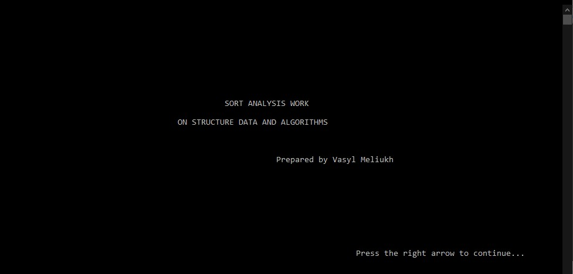
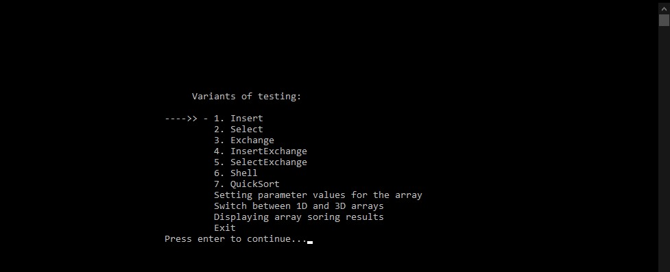
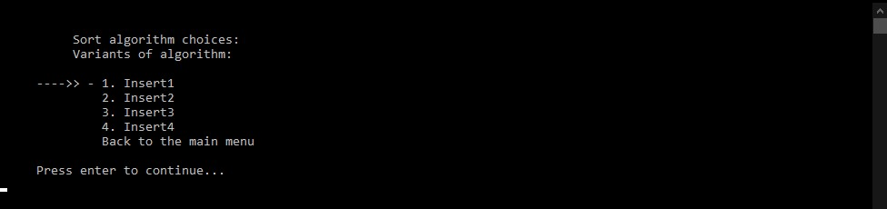
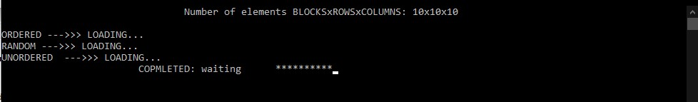
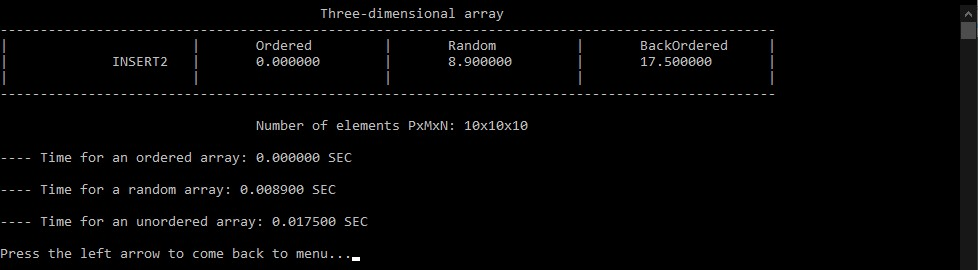
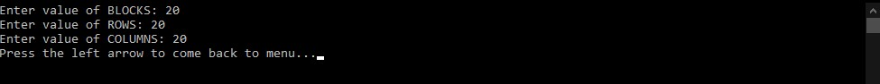
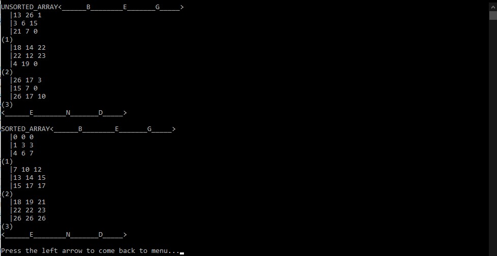
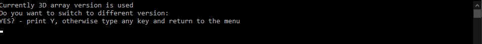
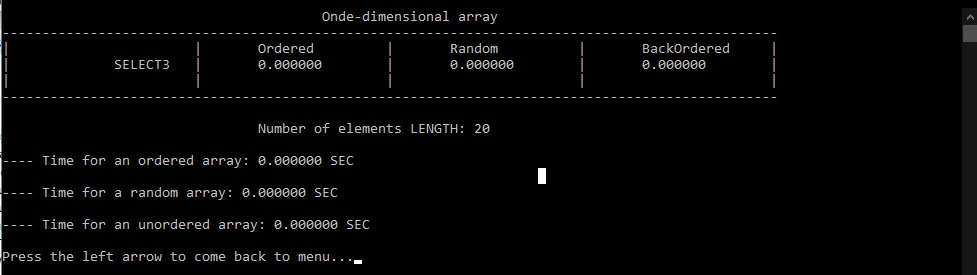
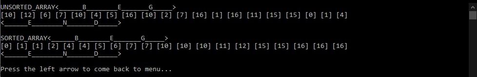

<h1>A console application for STUDYING THE EFFICIENCY OF SORTING ALGORITHMS ON MULTIDIMENSIONAL ARRAYS</h1>

## General info
The project performs the implementation of given algorithms for solving problems on multidimensional arrays using the principles of structural and modular programming, as well as the theoretical research part, which consists in measuring the time of operation of algorithms for both ordinary cases of a one-dimensional array and various cases of behavior algorithms on multidimensional arrays, and in the study of the reasons for the different behavior of these algorithms on one-dimensional and multidimensional arrays

## Types of the sorting algorithms implemented in the project

- Sorting algorithm No. 1 of the direct insertion method (with a linear search for the place of insertion from the beginning of the sequence being sorted, or "from the left")
- Sorting algorithm No. 2 of the direct insertion method (with a linear search for the place of insertion from the inserted element, or "on the right", without a barrier).
- Sorting algorithm No. 3 of the direct insertion method (with a linera search for the place of insertion from the inserted element, or "on the right", with a barrier).
- Sorting algorithm No. 4 of the direct insertion method (with a binary search for the insertion site).
- Sorting algorithm No. 1 of the direct selection method.
- Sorting algorithm No. 2 of the direct selection method.
- Sorting algorithm No. 3 of the direct selection method.
- Sorting algorithm No. 4 of the direct selection method.
- Sorting algorithm No. 5 of the direct selection method.
- Sorting algorithm No. 6 of the direct selection method.
- Sorting algorithm No. 7 of the direct selection method.
- Sorting algorithm No. 8 of the direct selection method.
- Sorting algorithm No. 1 of the direct exchange method (without modifications).
- Sorting algorithm No. 2 of the direct exchange method (using the flag).
-  Sorting algorithm No. 3 of the direct exchange method (with memorizing the place of the last permutation).
- Sorting algorithm No. 4 of the direct exchange method (Shaker sorting).
- Hybrid "insertion-exchange" algorithm.
- Hybrid algorithm "choice #1 - exchange".
- Hybrid algorithm "choice #2 - exchange".
- Hybrid algorithm "choice #3 - exchange".
- Hybrid algorithm "choice #4 - exchange".
- Algorithm No. 1 of the Shell sorting method.
- Algorithm No. 2 of the Shell sorting method.
- Algorithm of the "quick sorting" method (Hoare sorting).

## Technologies
Project is created with:
* C11: ISO/IEC 9899:2011
* gcc: version 6.3.0
* Win32 API
* CodeBlocks 20.03
	
## Setup
To run this project, install CodeBlocks or similar IDE with complilers that support MingW64 features, so that <windows.h> and <conio.h> libraries could be launched. Then git clone and run a program with the following commands:

## Interface Overview

<h4> Hello window with main info</h4>

<h4> Main menu structure </h4>

<h4> Submenu structure </h4>

<h4> Sorting process delay while executing coressponding methods</h4>

<h4> Time results of sorted arrays</h4>

<h4> Redefinition of the current array by disrupting the old one and declaring, allocating and setting new bounds</h4>

<h4> Displaying array filled with random values and aftermath of the sortng process </h4>

<h4> Switching between mods of 1D and 3D array</h4>

<h4> Time results of sorted vectors</h4>

<h4> Displaying vector results</h4>

# Analyzing of QuickSort, Select8 and Exchange3

Having studied all the algorithms, I come to the following conclusion:

- Although quick sort is considered the fastest, this algorithm also has certain disadvantages. One of the main ones is that quicksort is not always stable. Therefore, it can and sometimes needs to be modified to improve stability. Nevertheless, it performed almost the best among all, although knowing that the array is either ordered or close to it, direct exchange method #3 can be used.
- It was also possible to observe how the array behaves in various research cases. I learned that the sorting time depends on the size of the cross-section of the arrays, but not on the shape of the cross-section because the key to sorting is the length of the cross-sections and the shape of the cross-sections has little effect on the swap transition. And the more sections, the longer the time.
- It was possible to notice how inefficient direct exchange behaved in the case of unordered and reverse-ordered arrays. Therefore, knowing this situation, you should avoid this algorithm and use faster-sorting methods.
So, after analyzing all situations, we can say that inverted and unordered arrays are best sorted by a fast algorithm.
 
They win several times compared to others. Only an ordered array of direct exchange can show a better result. Therefore, the Hoare sorting method is the first in terms of speed, the second is direct insertion #8, and the last place is a direct exchange. As a result, based on this knowledge, it is necessary to take into account the effectiveness of these sorting methods. Since, in the same work, I experienced the time difference between exchange and Hoare sorts, I am sure that it will help to save time and computer memory.
